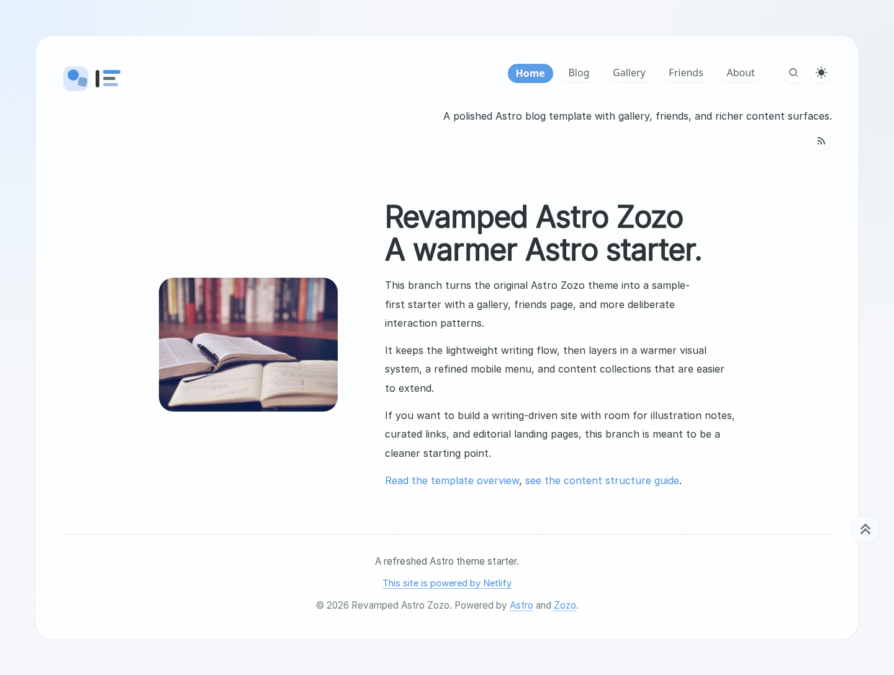
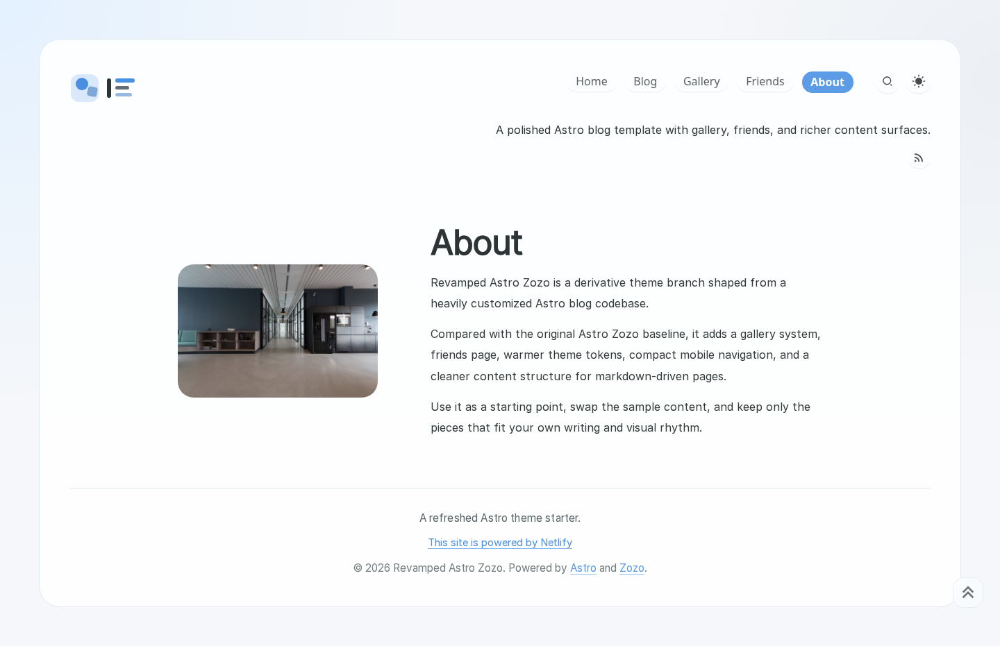
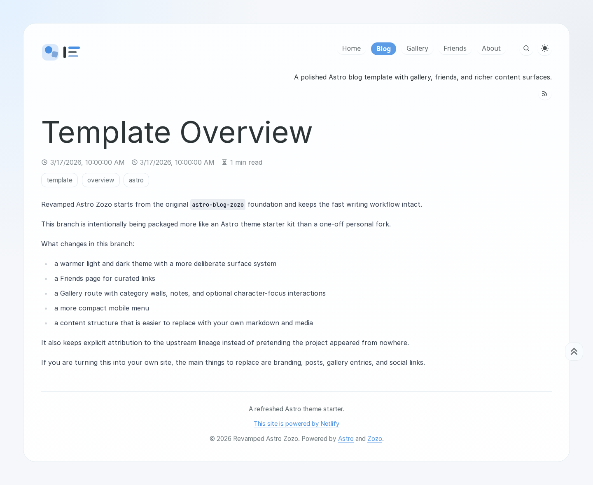

# Revamped Astro Zozo

A warm, editorial Astro 6 blog theme with gallery, friends page, Pagefind search, and light/dark mode — built for writers and creatives who want more than a minimal blog.

Revamped Astro Zozo is a sample-first Astro theme starter built with [Astro](https://astro.build), [Tailwind CSS](https://tailwindcss.com/), and [Bun](https://bun.sh/). It builds on the lightweight writing flow of [astro-blog-zozo](https://github.com/ladit/astro-blog-zozo) and adds a warmer visual system, richer content surfaces, and pages that go beyond a simple post list.

Repository: [Tito-XD/revamped-astro-zozo](https://github.com/Tito-XD/revamped-astro-zozo)  
Demo: [revamped-astrozozo.netlify.app](https://revamped-astrozozo.netlify.app)

Please read the [Code of Conduct](./CODE_OF_CONDUCT.md) before contributing or participating in project discussions.
Additional attribution and copyright notes are collected in [NOTICE](./NOTICE).

## Preview

| Home | About | Blog post |
| --- | --- | --- |
|  |  |  |

## Key Features

- Split-hero Home and About layouts for editorial landing pages
- Blog with tags, timeline archives, reading time, and RSS
- Gallery with category walls, viewer pages, notes, and optional character-focus hotspots
- Friends page for curated link cards
- Pagefind full-text search
- Light and dark mode with a persistent theme toggle
- KaTeX math support, Shiki code highlighting, and dynamic Open Graph images
- Giscus comments support (hidden by default until configured)

## Who It Is For

This theme works well if you publish long-form writing, maintain a visual gallery, or want a personal site that feels more like a magazine than a barebones blog starter.

## Project Lineage

This theme is a maintained derivative of:

- [ladit/astro-blog-zozo](https://github.com/ladit/astro-blog-zozo)

Which itself was inspired by:

- [varkai/hugo-theme-zozo](https://github.com/varkai/hugo-theme-zozo)

Original author: **Ladit**  
Current derivative/theme maintenance: **Tito_XD**

## Documentation

- [Getting Started](./docs/getting-started.md)
- [Publishing Notes](./docs/publishing-notes.md)
- [Astro Theme Submission Copy](./docs/astro-theme-submission.md)

## Thanks

Special thanks to the original authors and contributors whose work made this project possible.

- [ladit/astro-blog-zozo](https://github.com/ladit/astro-blog-zozo)
- [varkai/hugo-theme-zozo](https://github.com/varkai/hugo-theme-zozo)
- [Charca/astro-blog-template](https://github.com/Charca/astro-blog-template)
- [satnaing/astro-paper](https://github.com/satnaing/astro-paper)
- [ricora/alg.tus-ricora.com](https://github.com/ricora/alg.tus-ricora.com)
- [one-aalam/astro-ink](https://github.com/one-aalam/astro-ink)

## Current Stack

- Astro 6
- Tailwind CSS
- TypeScript
- Bun
- Pagefind search
- Giscus comments
- Netlify deployment

## What Changed From Astro Zozo

This template keeps the lightweight writing flow of Astro Zozo, then adds:

- a warmer light and dark palette with a more unified surface system
- a rewritten scaffold layout, footer, and navigation state treatment
- matching hero-style `Home` and `About` layouts
- a `/friends` page for curated link cards
- a `/gallery` route with category walls, viewer pages, notes, and optional focus hotspots
- markdown-backed gallery entries under `src/content/gallery/`
- a more compact mobile menu and tightened page heading system

## Sample Content

This theme intentionally replaces personal material with reusable sample content:

- sample blog posts with theme overview and setup guidance
- sample gallery entries with Unsplash photos and photographer credits
- sample friends data with portrait avatars
- sample branding, hero art, and a geometric logo

Use this theme as a base, then swap the sample content for your own writing, media, and visual identity. Sample photos are from [Unsplash](https://unsplash.com).

## Quick Start

1. Clone the repository
2. Install dependencies with `bun install` or `npm install`
3. Run `bun run dev` or `npm run dev`
4. Replace branding in `src/config.ts`, posts in `src/content/posts/`, gallery entries in `src/content/gallery/`, and friends data in `src/data/friends.ts`

Important folders to customize first:

- `src/config.ts` for site title, description, socials, and toggles
- `src/content/posts/` for blog posts
- `src/content/gallery/` for gallery entries and notes
- `src/data/friends.ts` for curated links
- `public/sample/` and `src/assets/sample/` for hero art, avatars, and gallery media

## Project Structure

- `src/content/posts/`: blog posts
- `src/content/gallery/`: gallery entries grouped by category
- `src/assets/sample/gallery/`: sample gallery media
- `src/assets/sample/portraits/`: sample focus portraits for interactive illustration pages
- `public/sample/`: logo, hero art, and friend avatars
- `src/data/friends.ts`: friends page data
- `src/config.ts`: site title, description, social links, and toggles
- `src/pages/`: route files
- `src/components/`: reusable UI parts
- `src/layouts/`: site layouts and page shells
- `src/utils/`: content, gallery, and UI-support helpers
- `docs/screenshots/`: theme preview captures for README and Astro Themes submission

## Development

Install dependencies:

```bash
bun install
```

Run local development:

```bash
bun run dev
```

Run checks:

```bash
bun run check
```

Build the site:

```bash
bun run build
```

Optional commands:

```bash
bun run lint
bun run format
```

Regenerate preview screenshots after visual changes:

```bash
npm run build
npx astro preview --host 0.0.0.0 --port 4321
node scripts/capture-screenshots.mjs
```

## Deployment

This theme is ready to deploy on Netlify.

Recommended settings:

- Node.js `22.12.0` or newer within the `22.x` line
- Base directory: `/`
- Build command: `bun run build`
- Publish directory: `dist`

## Open Source Readiness

This theme is structured to be easier to publish and review as an open-source starter:

- upstream MIT license notices are preserved
- a top-level [Code of Conduct](./CODE_OF_CONDUCT.md) is included
- footer attribution includes the required Netlify service link
- personal posts, gallery notes, avatars, and branding have been replaced with sample content
- preview screenshots and Astro Themes submission copy are included under `docs/`

## Credits

This project is based on [astro-blog-zozo](https://github.com/ladit/astro-blog-zozo) by Ladit and keeps its upstream MIT lineage intact.

It also carries inspiration from:

- [hugo-theme-zozo](https://github.com/varkai/hugo-theme-zozo)
- [astro-blog-template](https://github.com/Charca/astro-blog-template)
- [astro-paper](https://github.com/satnaing/astro-paper)
- [alg.tus-ricora.com](https://github.com/ricora/alg.tus-ricora.com)
- [astro-ink](https://github.com/one-aalam/astro-ink)

Sample photos are from [Unsplash](https://unsplash.com).

## License and Content

### Code

The code in this repository continues to inherit and preserve the original [MIT](./LICENSE) license terms from its upstream project. Original copyright and license notices should be retained.
See [NOTICE](./NOTICE) for additional attribution and project-specific copyright context.

### Sample Content

This theme includes sample copy and Unsplash-based JPEG assets so the site can be previewed immediately. Replace them with your own branding and materials before publishing a real site.
